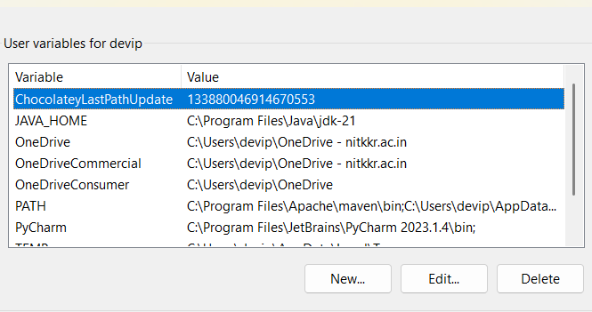
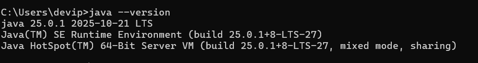
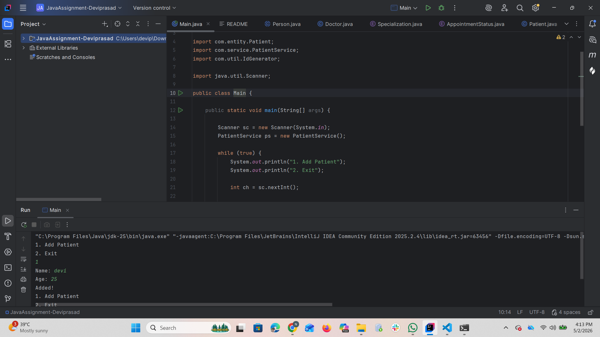

# Setup Instructions - MediTrack Project

## 1. Install Java (JDK)

### Step 1: Download JDK

- Go to: https://www.oracle.com/java/technologies/downloads/
- Download latest JDK (17 or above recommended)

### Step 2: Install

- Run the installer
- Follow default steps

---

## 2. Set Environment Variables (Windows)

### Step 1: Open Environment Variables

- Search: "Edit system environment variables"

### Step 2: Add JAVA_HOME

- Variable name: JAVA_HOME
- Variable value:
  Example:

  ```
  C:\Program Files\Java\jdk-17
  ```

### Step 3: Update PATH

Add:

```
%JAVA_HOME%\bin
```

---

## 3. Verify Installation

Open Command Prompt / PowerShell:

```bash
java -version
javac -version
```

Expected output:

- Java version displayed
- Compiler version displayed

---

## 4. Project Setup

### Step 1: Navigate to project

```bash
cd src/main/java
```

### Step 2: Compile project

```bash
javac com/airtribe/**/*.java
```

### Step 3: Run project

```bash
java com.airtribe.Main
```

---

## 5. IDE Setup (Optional - IntelliJ)

- Open IntelliJ IDEA
- Select "Open Project"
- Choose project root folder
- Set Project SDK → JDK 17+

Run:

- Right click → Main.java → Run

---

## 6. Common Issues

### Issue: "package does not exist"

✔ Ensure folder structure matches package
✔ Compile from `src/main/java`

### Issue: "java not recognized"

✔ Check JAVA_HOME and PATH

---

## 7. Screenshots

- JDK installation screen
- Environment variables
  
- `java -version` output
  
- Successful program run
  
